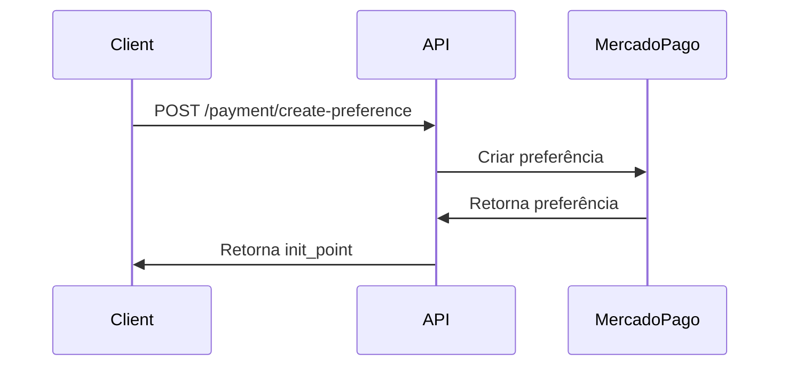
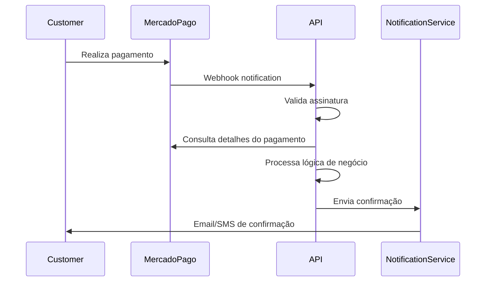

# Implementação Checkout Pro Mercado Pago com NestJS

## Visão Geral

Esta implementação fornece uma API completa para integração com o Checkout Pro do Mercado Pago, incluindo:

- Criação de preferências de pagamento
- Recebimento e processamento de webhooks
- Validação de assinaturas de segurança
- Processamento automático de pagamentos aprovados
- Sistema de notificações e confirmações
- Logs de auditoria completos
- Endpoints de retorno para diferentes status de pagamento

## Arquitetura

### Estrutura do Projeto

```
mercadopago-api/
├── src/
│   ├── config/
│   │   └── configuration.ts          # Configurações da aplicação
│   ├── controllers/
│   │   ├── payment.controller.ts     # Endpoints de pagamento
│   │   └── webhook.controller.ts     # Endpoints de webhook
│   ├── dto/
│   │   ├── create-preference.dto.ts  # DTO para criação de preferências
│   │   └── webhook-notification.dto.ts # DTOs para webhooks
│   ├── services/
│   │   ├── mercadopago.service.ts    # Serviço principal do MP
│   │   ├── webhook-validation.service.ts # Validação de webhooks
│   │   ├── notification.service.ts   # Envio de notificações
│   │   └── audit.service.ts          # Logs de auditoria
│   ├── app.module.ts                 # Módulo principal
│   └── main.ts                       # Ponto de entrada
├── .env                              # Variáveis de ambiente
└── package.json                      # Dependências
```

### Componentes Principais

#### 1. MercadoPagoService
- Integração com o SDK oficial do Mercado Pago
- Criação de preferências de pagamento
- Consulta de status de pagamentos
- Processamento de lógica de negócio

#### 2. WebhookController
- Recebimento de notificações do Mercado Pago
- Validação de assinaturas de segurança
- Processamento de eventos de pagamento

#### 3. NotificationService
- Envio de confirmações por email e SMS
- Geração de links de acesso/download
- Integração com sistemas externos

#### 4. AuditService
- Registro de todos os eventos de pagamento
- Logs estruturados para análise
- Alertas para eventos críticos

## Configuração

### Variáveis de Ambiente

Crie um arquivo `.env` com as seguintes configurações:

```env
# Configurações do Mercado Pago
MERCADOPAGO_ACCESS_TOKEN=your_access_token_here
MERCADOPAGO_PUBLIC_KEY=your_public_key_here
MERCADOPAGO_WEBHOOK_SECRET=your_webhook_secret_here

# Configurações da aplicação
PORT=3000
NODE_ENV=development

# URLs de retorno
SUCCESS_URL=http://localhost:3000/payment/success
FAILURE_URL=http://localhost:3000/payment/failure
PENDING_URL=http://localhost:3000/payment/pending

# URL do webhook
WEBHOOK_URL=https://your-domain.com/webhook/mercadopago
```

### Instalação

1. Clone o projeto:
```bash
git clone <repository-url>
cd mercadopago-api
```

2. Instale as dependências:
```bash
npm install
```

3. Configure as variáveis de ambiente:
```bash
cp .env.example .env
# Edite o arquivo .env com suas credenciais
```

4. Compile o projeto:
```bash
npm run build
```

5. Execute a aplicação:
```bash
npm run start:prod
```

## Endpoints da API

### Pagamentos

#### POST /payment/create-preference
Cria uma nova preferência de pagamento.

**Request Body:**
```json
{
  "title": "Produto Exemplo",
  "description": "Descrição do produto",
  "quantity": 1,
  "unit_price": 100.00,
  "currency_id": "BRL",
  "external_reference": "PRODUCT_123",
  "payer": {
    "name": "João",
    "surname": "Silva",
    "email": "joao@email.com",
    "phone": {
      "area_code": "11",
      "number": "999999999"
    }
  }
}
```

**Response:**
```json
{
  "success": true,
  "data": {
    "id": "123456789",
    "init_point": "https://www.mercadopago.com.br/checkout/v1/redirect?pref_id=123456789",
    "sandbox_init_point": "https://sandbox.mercadopago.com.br/checkout/v1/redirect?pref_id=123456789"
  },
  "message": "Preferência criada com sucesso"
}
```

#### GET /payment/success
Endpoint de retorno para pagamentos aprovados.

#### GET /payment/failure
Endpoint de retorno para pagamentos rejeitados.

#### GET /payment/pending
Endpoint de retorno para pagamentos pendentes.

#### GET /payment/status/:paymentId
Consulta o status de um pagamento específico.

### Webhooks

#### POST /webhook/mercadopago
Recebe notificações do Mercado Pago sobre mudanças de status dos pagamentos.

**Headers necessários:**
- `x-signature`: Assinatura de segurança do Mercado Pago
- `x-request-id`: ID único da requisição

## Fluxo de Pagamento

### 1. Criação da Preferência


### 2. Processamento do Pagamento


## Segurança

### Validação de Webhooks

A API implementa validação completa de webhooks conforme documentação do Mercado Pago:

1. **Validação de Assinatura**: Verifica se a notificação é realmente do Mercado Pago
2. **Validação de Timestamp**: Evita ataques de replay
3. **Verificação de Origem**: Confirma que a requisição vem dos servidores oficiais

### Exemplo de Validação

```typescript
const isValid = webhookValidationService.validateSignature(
  xSignature,
  xRequestId,
  dataId,
  rawBody,
  webhookSecret
);
```

## Lógica de Negócio

### Processamento por Tipo de Produto

A API suporta diferentes tipos de produtos baseados na referência externa:

#### Cursos Online (`COURSE_*`)
- Criação de usuário no sistema
- Matrícula automática
- Envio de credenciais de acesso

#### Produtos Digitais (`PRODUCT_*`)
- Geração de link de download temporário
- Controle de expiração
- Registro de downloads

#### Serviços (`SERVICE_*`)
- Ativação de serviços
- Configuração de período de validade
- Notificação da equipe

#### Assinaturas (`SUBSCRIPTION_*`)
- Ativação de assinatura
- Configuração de renovação automática
- Definição de data de vencimento

### Exemplo de Implementação

```typescript
private async executeBusinessLogic(payment: PaymentDetailDto): Promise<void> {
  const externalRef = payment.external_reference;
  
  if (externalRef?.startsWith('COURSE_')) {
    await this.activateCourseAccess(payment, externalRef);
  } else if (externalRef?.startsWith('PRODUCT_')) {
    await this.enableProductDownload(payment, externalRef);
  }
  // ... outros tipos
}
```

## Sistema de Notificações

### Tipos de Notificação

1. **Email de Confirmação**
   - Detalhes do pagamento
   - Links de acesso/download
   - Credenciais quando aplicável

2. **SMS de Confirmação**
   - Notificação rápida de aprovação
   - Link de acesso principal

3. **Webhooks Externos**
   - Integração com outros sistemas
   - Notificação de CRM/ERP

### Personalização de Conteúdo

```typescript
private buildEmailContent(data: PaymentConfirmationData): string {
  return `
    <h2>Pagamento Aprovado!</h2>
    <p>Seu pagamento de R$ ${data.amount.toFixed(2)} foi aprovado.</p>
    ${data.paymentLink ? `<a href="${data.paymentLink}">Acessar Produto</a>` : ''}
  `;
}
```

## Logs e Auditoria

### Eventos Registrados

- Criação de preferências
- Recebimento de webhooks
- Processamento de pagamentos
- Envio de notificações
- Erros e falhas

### Estrutura dos Logs

```json
{
  "timestamp": "2025-01-11T10:30:00Z",
  "event": "payment.approved.processing_completed",
  "paymentId": 123456,
  "externalReference": "PRODUCT_123",
  "amount": 100.00,
  "payerEmail": "cliente@email.com",
  "source": "webhook"
}
```

### Alertas Automáticos

- Pagamentos de alto valor (> R$ 10.000)
- Múltiplas rejeições do mesmo cliente
- Eventos críticos (estornos, chargebacks)

## Testes

### Ambiente de Sandbox

Para testes, use as credenciais de sandbox do Mercado Pago:

```env
MERCADOPAGO_ACCESS_TOKEN=TEST-your-test-token
MERCADOPAGO_PUBLIC_KEY=TEST-your-test-public-key
```

### Cartões de Teste

- **Aprovado**: 4509 9535 6623 3704
- **Rejeitado**: 4013 5406 8274 6260
- **Pendente**: 4389 3540 6624 0648

### Simulação de Webhooks

Use o simulador no painel do Mercado Pago para testar os webhooks:

1. Acesse "Suas Integrações"
2. Selecione sua aplicação
3. Vá em "Webhooks > Configurar notificações"
4. Use a função "Simular"

## Monitoramento

### Métricas Importantes

- Taxa de conversão de pagamentos
- Tempo de processamento de webhooks
- Falhas de validação de assinatura
- Volume de notificações enviadas

### Health Check

```bash
curl http://localhost:3000/
```

### Logs de Aplicação

```bash
# Visualizar logs em tempo real
npm run start:dev

# Logs de produção
tail -f logs/application.log
```

## Troubleshooting

### Problemas Comuns

#### 1. Webhook não recebido
- Verifique se a URL está acessível publicamente
- Confirme se o HTTPS está configurado
- Verifique os logs do Mercado Pago

#### 2. Assinatura inválida
- Confirme se o webhook secret está correto
- Verifique se o timestamp não expirou
- Confirme se o body da requisição não foi modificado

#### 3. Pagamento não processado
- Verifique os logs de auditoria
- Confirme se o webhook foi recebido
- Verifique se há erros na lógica de negócio

### Debug

```typescript
// Habilitar logs detalhados
this.logger.debug('Processando webhook', {
  paymentId,
  action,
  timestamp: new Date().toISOString()
});
```

## Próximos Passos

### Melhorias Sugeridas

1. **Banco de Dados**
   - Implementar persistência dos logs de auditoria
   - Armazenar histórico de pagamentos
   - Cache de consultas frequentes

2. **Testes Automatizados**
   - Testes unitários para todos os serviços
   - Testes de integração com sandbox
   - Testes de carga para webhooks

3. **Monitoramento Avançado**
   - Integração com Prometheus/Grafana
   - Alertas via Slack/Discord
   - Dashboard de métricas em tempo real

4. **Segurança Adicional**
   - Rate limiting para webhooks
   - Whitelist de IPs do Mercado Pago
   - Criptografia de dados sensíveis

## Suporte

Para dúvidas ou problemas:

1. Consulte a [documentação oficial do Mercado Pago](https://www.mercadopago.com.br/developers)
2. Verifique os logs de auditoria da aplicação
3. Use o simulador de webhooks para testes
4. Entre em contato com o suporte técnico

---

**Versão:** 1.0.0  
**Data:** Janeiro 2025  
**Autor:** Implementação com NestJS e TypeScript

